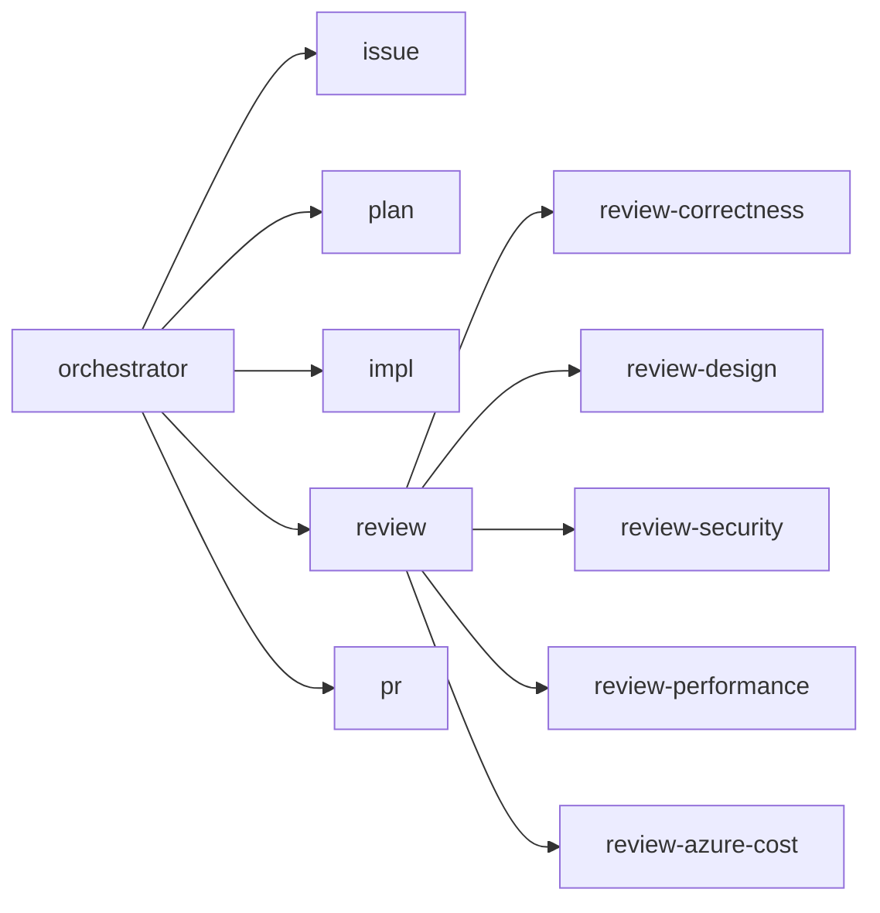

# ガイドライン

## 全般

- `.github/copilot-instructions.md` : Copilot の振る舞い

## サブエージェント

```
.github/
└── agents/
    ├── orchestrator.agent.md  # オーケストレーター
    ├── issue.agent.md         # Issue 作成/管理
    ├── plan.agent.md          # 実装計画の策定
    ├── impl.agent.md          # TDD に基づく実装
    ├── review.agent.md        # レビューの統括・統合
    ├── review-correctness.agent.md  # 要求適合・ロジック・テスト
    ├── review-design.agent.md       # 設計・可読性・ドキュメント
    ├── review-security.agent.md     # セキュリティ
    ├── review-performance.agent.md  # パフォーマンス
    ├── review-azure-cost.agent.md   # Azure コスト
    └── pr.agent.md            # PR 作成
```

### 呼び出し階層

`orchestrator` → `review` → `review-*` の 2 段ネストで動作します。



ネストを成立させるための frontmatter 設定は以下のとおりです。

| エージェント | `tools` に `agent` | `user-invocable` | `disable-model-invocation` |
| --- | --- | --- | --- |
| `orchestrator` | 必要 | `true` | `true` |
| `review` | 必要 | `true` | `false` |
| `review-*` | 不要 | `false` | `false` |

- 親になるエージェント (`orchestrator`, `review`) は `tools` に `agent` を含め、`#tool:agent/runSubagent` で子を呼び出します。
- 子として呼ばれるエージェントは `disable-model-invocation: false` にします。`true` にすると親から呼び出せません。
- `review-*` は `user-invocable: false` としてユーザーのエージェント一覧に出さず、`review` 経由でのみ実行します。
- `review-*` は `tools` に `agent` を含めないため、これ以上ネストしません（葉ノード）。
